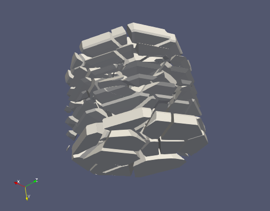
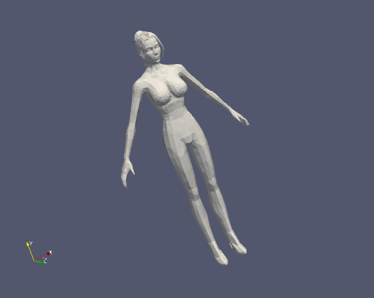

1. 计算数据缩放scale和偏移量offset

        FBoundingBox mBox(meshdata.m_Vertices);
        FVec3 moffset = (mBox.m_Max + mBox.m_Min) * 0.5f;
        float mscale = std::max(mBox.m_Size.X,std::max(mBox.m_Size.Y,mBox.m_Size.Z));
        float mscalefactor = 1 / mscale;

2. 创建切割m对象mesh的box accelerator
3. ‰ª?boundingboxÂàõª∫voronoi 3d diagramÔºåËæìÂÖ?sitesËÆ°ÁÆóÂæóÂà∞cells
   
        FVoronoi3D voronoiDiagram(mBox);
        for (auto& site : sites) {
            site = (site - moffset) * mscalefactor;
            voronoiDiagram.AddSite(site);
        }

4. ÊØè‰∏™cells‰∏éÂàáÂâ≤Â?π˱°ËøõË?åÂ∏ÉÂ∞îʱlj∫§ËøêÁÆ?
   
        VoroCellInfo& cell = info[i];
        FMeshData voroCell=ConstructMeshdata(cell);
        if (voroCell.m_Vertices.empty())
            continue;

        FBoundingBox voroBox(voroCell.m_Vertices);
        FBooleanCutter collecter(voroBox, voroCell);
        collecter.SetSourceMesh(m_Accel);
        FMeshData chunk = collecter.FetchResult(INTERSECT);
        TransformMesh(chunk, FVec3() - moffset-cell.Position, mscale);

5. 结果展示
   <table rules="none" frame= "void">
   <tr>
        <td>
            

                source
            

        </td>
        <td>
            

                10 chunk
            

        </td> 
        <td>
            

                100 chunk
            

        </td> 
   </tr>
    <tr>
        <td>
            

                
            

        </td>
        <td>
            

                
            

        </td>    
        <td>
            

                
            

        </td>    
    </tr>
        <tr>
        <td>
            

                
            

        </td>
        <td>
            

                
            

        </td>    
        <td>
            

                
            

        </td>    
    </tr>
        <tr>
        <td>
            

                
            

        </td>
        <td>
            

                
            

        </td>    
        <td>
            

                
            

        </td>    
    </tr>
        <tr>
        <td>
            

                
            

        </td>
        <td>
            

                
            

        </td>    
        <td>
            

                
            

        </td>    
    </tr>
        <tr>
        <td>
            

                
            

        </td>
        <td>
            

                
            

        </td>    
        <td>
            

                
            

        </td>    
    </tr>
        <tr>
        <td>
            

                
            

        </td>
        <td>
            

                
            

        </td>    
        <td>
            

                
            

        </td>    
    </tr>
        <tr>
        <td>
            

                
            

        </td>
        <td>
            

                
            

        </td>    
        <td>
            

                
            

        </td>    
    </tr>
        <tr>
        <td>
            

                
            

        </td>
        <td>
            

                
            

        </td>    
        <td>
            

                
            

        </td>    
    </tr>
        <tr>
        <td>
            

                
            

        </td>
        <td>
            

                
            

        </td>    
        <td>
            

                
            

        </td>    
    </tr>
</table>