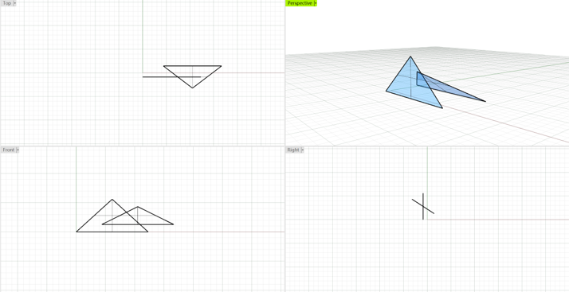
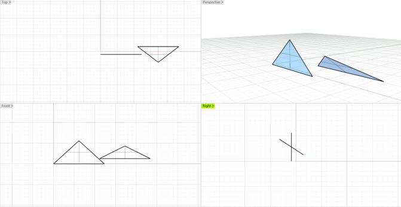
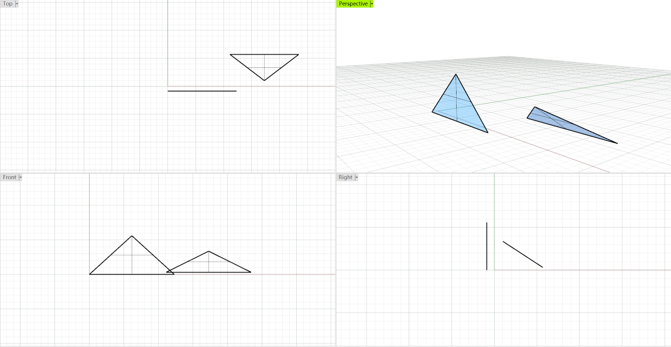

## 三角形相交计算原理

<table rules="none" frame= "void">
    <tr>
        <td>
            

                <text>Senario 1</text>
            

        </td>
        <td>
            

               <text>Senario 2</text>
            

        </td>    
        <td>
            

                <text>Senario 3</text>
            

        </td>
    </tr>
    <tr>
        <td>
            

                
            

        </td>
        <td>
            

               
            

        </td>    
        <td>
            

                
            

        </td>
    </tr>
</table>
