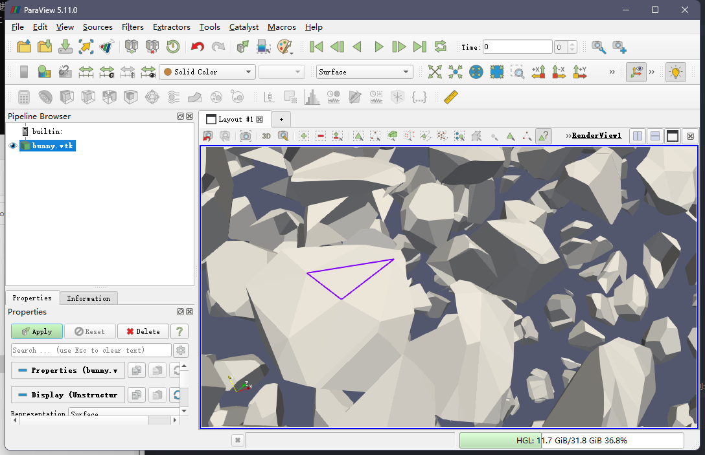
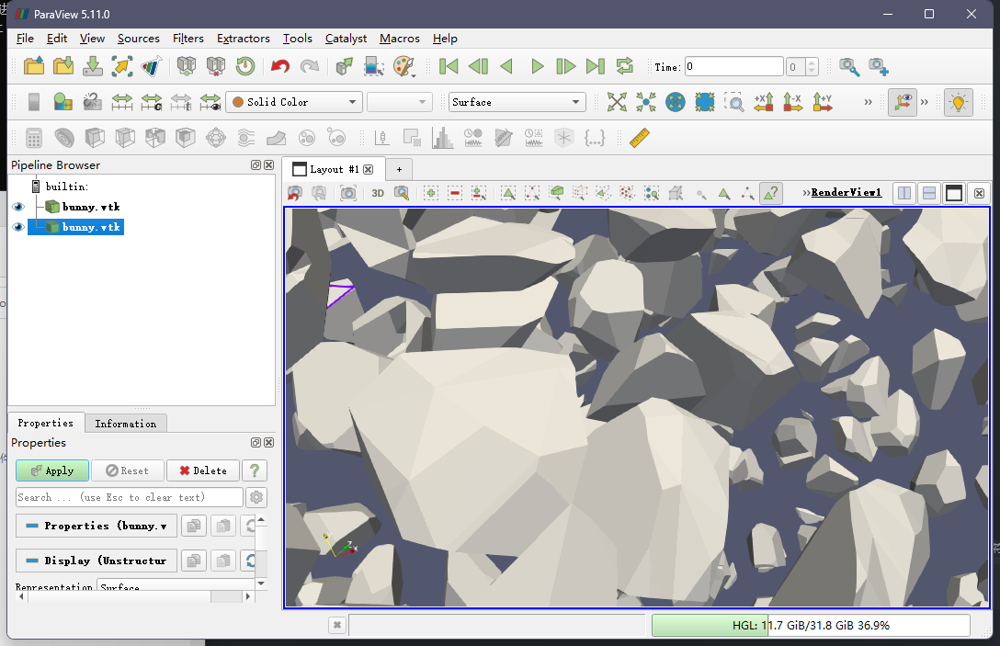
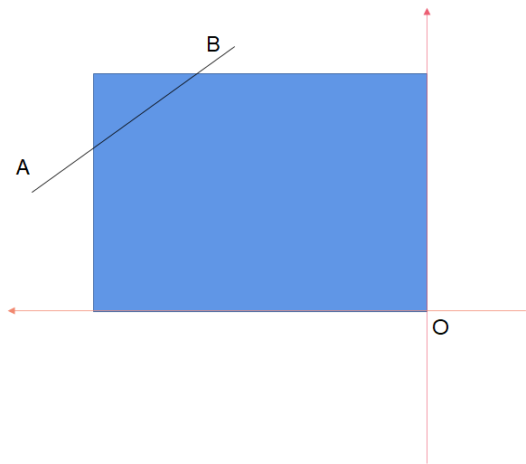

1. 模型剔除错误
   * 问题
      
   <table rules="none" frame= "void">
        <tr>
            <td>
                

                    
                

            </td>
            <td>
                

                    
                

            </td>    
        </tr>
    </table>

    * 原因
   
    
    
    如图所示，在采样完mesh之后，可能会出现图中的情况。假设矩形为包围盒，AB为射线检测的mesh，判断o点在AB内侧时，进行x,y,z，-x，-y,-z六个方向的射线检测均不会命中mesh，从而导致命中计数为0，被误判为在mesh外。

    * 解决方法
      
    增加o为起点，o点指向AB中任一点方向的射线检测。